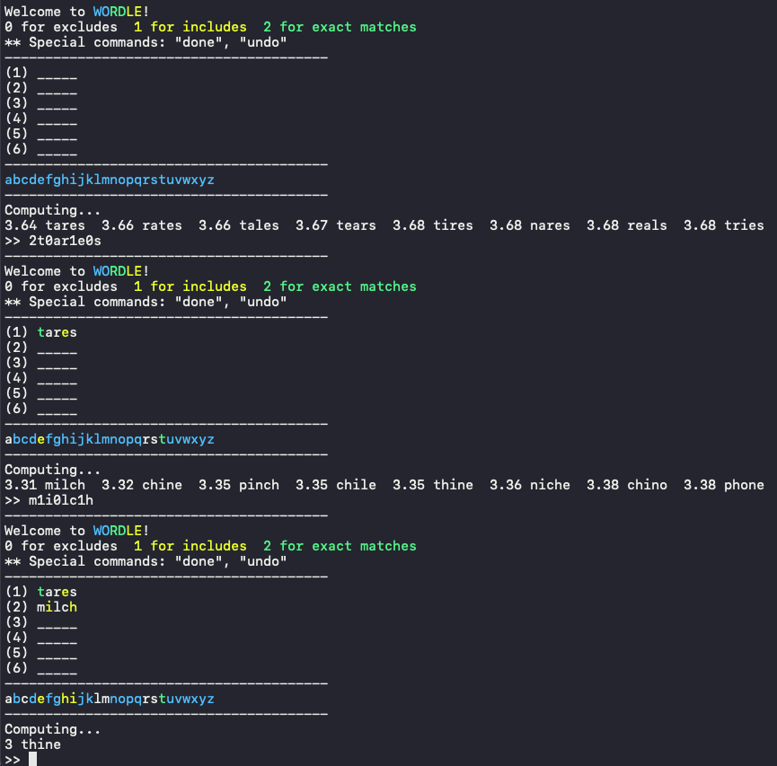

# Wordle Advicer
*A Toy project about Wordle puzzle solver in C++, CUI*

## Overview


Based on the algorithm explained on
[3Blue1Brown](https://www.youtube.com/channel/UCYO_jab_esuFRV4b17AJtAw)'s video
[Solving Wordle using information
theory](https://www.youtube.com/watch?v=v68zYyaEmEA&t=1031s). Thank you for your
great inspiring video! My implementation tries to minimize the expected number
of total guesses, without any look-ahead step (simple algorithm).

The word dictionary sorted by the frequencies is fetched from
[charlesreid1/five-letter-words](https://github.com/charlesreid1/five-letter-words/blob/master/sgb-words.txt).
Thank you for your hard works!

## Install Prerequisites
Please install `g++` and `cmake` to build the project.
```bash
apt-get update
apt-get install g++ cmake
```

## Build and Play
To build the project, please run
```bash
./build.sh
```
If the compilation is successfully done, then you can see two binaries
`./build/src/play/Play` and `./build/src/play/Advice`.

### Play mode
Wordle game play mode. Please type `./build/src/play/Play` on your terminal.
- You can use a (pretty decent) Wordle advicer by typing `'y'` in the beginning.
- Guess small-case 5-lettered words that are listed in the `dictionary.txt`.
  - GREEN for exact matches, YELLOW for includes, and DEFAULT color for excludes
    as we all know.
- Type `"give up"` if you want to give up and see the answer word.
- Type `"undo"` to undo the latest guess.

### Advice mode
Advice mode when you are playing Wordle game externally (e.g., NYT). Please type
`./build/src/play/Advice` on your terminal.
- It will provide top-8 word suggestions.
- You can give the external Wordle game's feedback;
  - The feedback string should contains only small-case alphabets (`'a'`-`'z'`)
    and `'0'`, `'1'`, `'2'`.
  - The number of alphabet letters should be 5.
  - The letters that came after `'0'` (default) are EXCLUDES, `'1'` are
    INCLUDES(YELLOW) and `'2'` are for EXACT_MATCH(GREEN).
    - For example, the feedback `"wo1r2d0s"` is valid, the parsed guess is
      `"words"` and the result state for each letter is `{EXCLUDES, EXCLUDES,
      INCLUDES, EXACT_MATCH, EXCLUDES}`.
- Type `"done"` if you finish your game and want to restart or quit the advicer.
- Type `"undo"` to undo the latest feedback.

## TODO
Several TODO to implement later
- **Conservative mode** support.
  - The current mode only tries to minimize the expected number of total
    guesses.
  - It works poorly, for example if the answer is `"sates"`, then it will
    suggest `"tares"` -> `"humpf"` -> `"dates"` -> `"gates"` -> `"bates"` ->
    `"nates"`, and you will lose the game.
    - However, if you guess `"badge"` instead of `"dates"`, then you will not
      lose even though its expected number of total guesses is larger.
  - The conservative mode will try to finish the game within the 6 steps, more
    than minimizing the expected number of total guesses.
- Also, GUI support?
  - I don't think users who followed this instruction might be enough
    comfortable in CUI. Low prioritized.